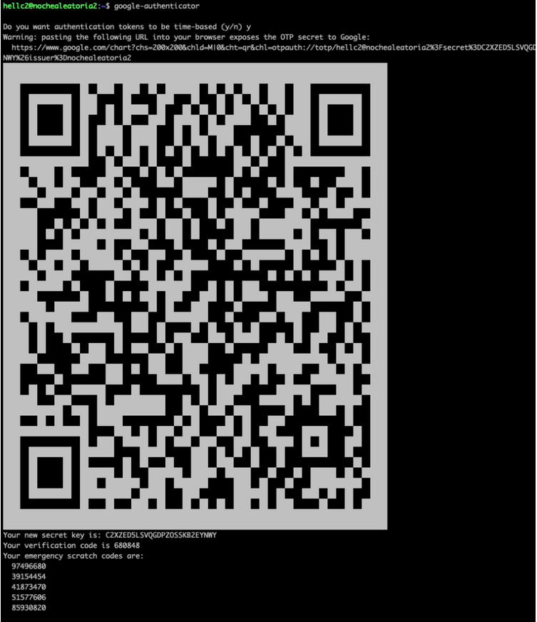
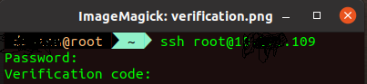

# two-factor-authentication-over-SSH
This project will help you add two factor authentication to your remote vms.

This documentation is verification of https://translate.google.com/translate?sl=auto&tl=en&u=https://www.sinologic.net/2020-11/autentificacion-dos-pasos-debian-10.html

### Getting Started
- login to your remote device using SSH
- run the following commands
- ~$ sudo apt update
- ~$ sudo apt install libpam-google-authenticator

(Install nano editor if you haven't or use any other editor)
- nano /etc/ssh/sshd_config

make sure you have the following enabled
- UsePAM yes
- ChallengeResponseAuthentication yesUsePAM yes
ChallengeResponseAuthentication yes

save and return

run the following command 
- ~$ nano /etc/pam.d/common-auth

Write the following lines

- # Autentificacion OTP mediante Google Authenticator

- auth required pam_google_authenticator.so

save and return

Now install FreeOTP softare on your phone
[FreeOTP](https://freeotp.github.io/)

Now write the following command in the terminal

~$ google-authenticator

and selected the services you want to avail

This otp will appear on your terminal.
Save the secuty keys, credentials and picture of the OTP with you.

Open the application in the phone 
- scan the code
- the key will be added in your phone
-restart the ssh using 
~$ service ssh restart

Now try to login using SSH again. It will first ask for password and then verification code that will be generated on your phone after every 30 seconds

